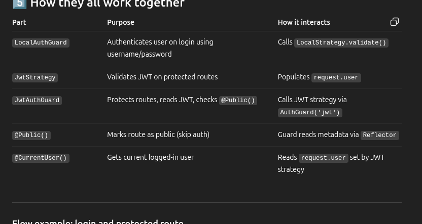

This is SQLLITE3 BASED RBAC

nest g res users

nest g res auth

npm i --save @nestjs/typeorm typeorm sqlite3

npm i --save class-validator class-transformer

npm install -D @types/bcryptjs

npm install bcryptjs

import * as bcrypt from 'bcryptjs';

npm install @nestjs/jwt

npm install --save @nestjs/passport passport passport-local

npm install --save-dev @types/passport-local

 npm i --save @nestjs/config

npm install --save @nestjs/jwt passport-jwt

npm install --save-dev @types/passport-jwt

npm install cookie-parser
npm install -D @types/cookie-parser

